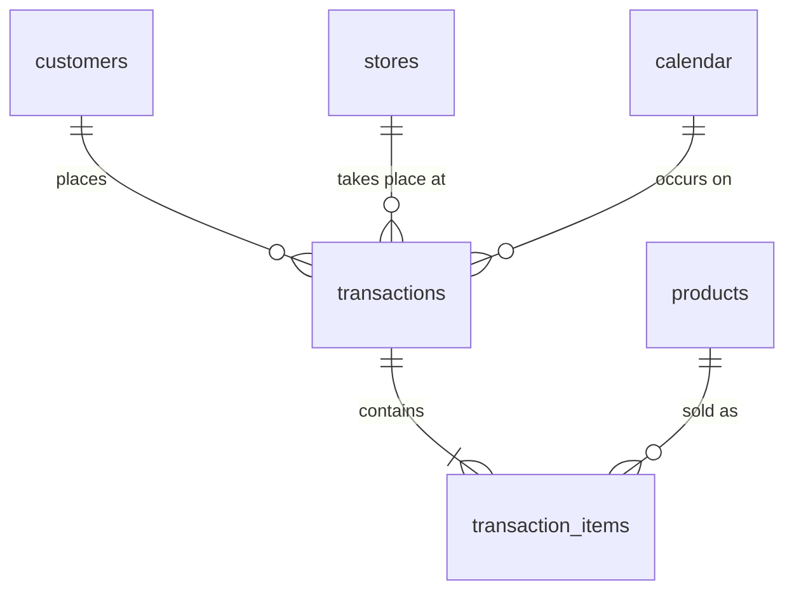

<div align="center">


# Retail Sales & Basket Analysis


### SQL-Driven Cohort and Market-Basket Analysis of Multi-Store Grocery Transactions


**Two questions: do first-basket categories drive repeat visits, and which category pairs genuinely sell together?**

</div>

---

## Overview

This project analyses 2.6M grocery transaction lines from 2,500 households across 556
stores. It asks whether the **category a household buys first predicts how often it
comes back**, and **which category pairs are genuinely bought together** once basket
size is accounted for.

Everything is done in **PostgreSQL**: profiling, cleaning, cohorts, market-basket
metrics and index tuning. Python is used only to draw the charts. Each analysis step is
a separate, commented SQL script, and every cleaning rule is logged with the number of
rows it affected.

## Key Result

> After correcting for basket size, only a handful of category pairs show strong
> cross-sell affinity (baby, pet and meal-mission pairs), while popular staples such as
> bread + milk fall to near-chance (lift 1.07). No first-basket category reliably
> predicted repeat visits.

| Analysis | Question | Result |
|---|---|---|
| Data cleaning | How much of the raw data is usable? | 98.0% of lines kept, 0 rows unaccounted, item sales = basket sales |
| Cohorts | Does the first-basket category predict repeat visits? | 1 of 77 categories nominally significant, 0 after multiple-testing correction |
| Basket analysis (naive) | Which pairs have lift above 1? | 96.5% of 14,820 pairs (median lift 2.13) |
| Basket analysis (adjusted) | Same, after stratifying by basket breadth | 44.9% of pairs (median lift 0.98) |
| Index tuning | Does indexing speed up lookups? | 328 ms to 0.19 ms and 329 ms to 5.3 ms |

**Naive vs. basket-size-adjusted lift** (1.0 = no association beyond chance):

| Pair | Naive lift | Adjusted lift |
|---|---|---|
| Baby foods + Infant formula | 16.3 | 16.5 |
| Baby HBC + Diapers | 15.2 | 10.5 |
| Cat food + Cat litter | 16.8 | 10.2 |
| Dry pasta + Pasta sauce | 9.8 | 3.1 |
| Cheeses + Deli meats | 9.2 | 3.9 |
| Hot dogs + Buns | 2.9 | 1.4 |
| Cold cereal + Milk | 2.4 | 1.3 |
| Bag snacks + Soft drinks | 1.7 | 1.3 |
| Bread + Milk | 1.9 | 1.1 |

## Main Findings

1. **The raw data was structurally clean, so cleaning was about business rules.**
   Profiling found no duplicates, orphan products, inconsistent baskets, null keys or
   negative values. 51,120 lines (2.0%) were removed: 18,879 with zero sales value and
   32,241 non-merchandise lines (fuel, coupons, miscellaneous, blank category).
2. **No first-basket category reliably predicts repeat visits.** Of 77 categories
   tested (at least 100 households each), only soft drinks reached nominal significance
   (+1.2 visits in 90 days, +10%). About 4 false positives are expected by chance at the
   5% level, and the result does not survive a Bonferroni correction (p of about 0.007
   vs. about 0.0006 needed).
3. **Retention is flat at 78 to 83% in every enrollment cohort** over 18 months. This
   reflects the sample (frequent shoppers: 99.8% made 2 or more baskets), not retailer
   performance.
4. **Basket size inflates lift.** Large stock-up baskets contain many categories, so
   almost every pair looks "bought together". Stratifying by basket breadth brings the
   median lift from 2.13 to 0.98, the expected baseline for unrelated pairs.
5. **The strongest real affinities are family and meal-mission pairs.** Baby and pet
   pairs hold up after adjustment. By volume, the biggest opportunities are cheeses +
   deli meats (+5,296 baskets above expected), dry pasta + pasta sauce (+4,380) and bath
   tissue + paper towels (+2,474). A breakfast cluster spans two departments: bacon +
   eggs (+1,782 baskets, lift 1.6).
6. **Substitutes exist.** Deli meats and lunchmeat have an adjusted lift of 0.57, with
   1,528 fewer joint baskets than expected, so promoting them together would split
   demand.
7. **Indexes mattered.** Adding indexes on `transaction_items(basket_id)` and
   `transactions(household_key)` turned full scans of about 2.5M rows into index
   lookups: a basket lookup fell from 328 ms to 0.19 ms (about 1,760x) and a 3-table
   household query from 329 ms to 5.3 ms (about 62x).

## Recommendations

- **Bundle and co-locate by meal mission:** pasta + sauce, the breakfast cluster, and
  salad mix + dressing combine real lift with thousands of excess baskets.
- **Do not promote substitutes together** (deli meats and lunchmeat).
- **Do not build acquisition or retention promotions around a "gateway" category.**
- **Prioritise by excess baskets, not lift alone:** the highest-lift pairs are often
  small niches.
- **Validate with an A/B test before rollout:** everything here is co-purchase
  association.

## Charts


*Share of each enrollment cohort active in every 30-day period. Period 0 is 100% by
definition; read from period 1 onward.*


*Extra visits in 90 days vs. households with a similar-sized first basket, with 95%
confidence intervals. Nearly all intervals cross zero.*


*Adjusting for basket size removes most of the apparent lift for staple pairs but not
for baby and pet pairs.*


*Pairs with adjusted lift of at least 1.5, ranked by excess baskets (volume), with lift
shown at each bar.*

## Pipeline

| # | Script | Idea | What it does |
|---|---|---|---|
| 1 | `01_schema.sql` | Land raw data untouched | Creates staging tables for the raw CSVs |
| 2 | `03_profiling.sql` | Measure before cleaning | Eight data-quality checks that drive the cleaning rules |
| 3 | `04_cleaning.sql` | Rules from evidence, all logged | Clean tables with keys, calendar, non-merchandise flag, cleaning log, reconciliation |
| 4 | `05_eda.sql` | Understand the business | Monthly revenue (`LAG`), store `RANK`, category share, basket stats, spend deciles (`NTILE`), hourly pattern |
| 5 | `06_cohort_diagnostics.sql` | Check the data before designing cohorts | Enrollment ramp-up, churn and inter-visit gaps |
| 6 | `07_cohorts.sql` | Compare like with like | First-basket-category cohorts, size-adjusted 90-day visits, retention table |
| 7 | `08_basket_analysis.sql` | Classic market-basket metrics | Support, confidence and lift for category pairs |
| 8 | `09_basket_adjusted.sql` | Remove the basket-size effect | Stratified lift: expected pair counts computed within breadth tiers |
| 9 | `10_export_and_priorities.sql` | Rank by volume, not ratio | CSV exports and excess-baskets ranking |
| 10 | `11_performance.sql` | Show the plan, not just the query | Indexes with `EXPLAIN (ANALYZE, BUFFERS)` before and after |

The numbering skips 02 because that step is the CSV load, shown under Getting Started.

**SQL techniques:** CTEs, window functions (`LAG`, `RANK`, `NTILE`, `ROW_NUMBER`,
`SUM() OVER`, `FIRST_VALUE`), `FILTER` aggregates, `PERCENTILE_CONT`,
`MODE() WITHIN GROUP`, `DISTINCT ON`, self-joins, `CREATE TABLE AS`, constraints,
transactions, reconciliation checks, indexing, query-plan analysis.

**Cleaning rules (from `cleaning_log`):**

| Rule | Action | Lines | % of raw lines |
|---|---|---|---|
| Sales value = 0 | Removed | 18,879 | 0.73% |
| Non-merchandise (fuel, coupons, misc, blank) | Removed | 32,241 | 1.24% |
| Quantity = 0 but revenue > 0 | Kept and flagged | 37 | 0.00% |
| Quantity > 100 | Kept and flagged | 1 | 0.00% |
| **Clean lines kept** | | **2,544,612** | **98.03%** |

**Design decisions:**

- **Cohorts use first-basket category, not first-purchase month.** 99% of households
  first appear between January and April 2010 (study enrollment), and only 2.8% stop
  shopping, so month cohorts and "ever returned" cannot discriminate.
- **The outcome is shopping days in the 90 days after the first basket,** compared with
  households that had a similar-sized first basket (5 tiers), because small top-up
  baskets come from more frequent shoppers.
- **Lift is stratified by basket breadth** (5 tiers by number of categories), so large
  stock-up baskets do not inflate every pair.

## Dataset

| Table | Raw rows | Clean table | Clean rows |
|---|---|---|---|
| `transaction_data` | 2,595,732 | `transaction_items` | 2,544,612 |
| | | `transactions` (one row per basket) | 250,960 |
| `product` | 92,353 | `products` (91,664 merchandise) | 92,353 |
| `hh_demographic` | 801 | `customers` | 2,500 |
| | | `stores` | 556 |
| | | `calendar` | 711 |

2,500 households, 711 days, 556 stores after cleaning (582 in the raw data).



Expected layout of the raw files:

```
data/
├── transaction_data.csv
├── product.csv
├── hh_demographic.csv
├── campaign_desc.csv          # not used in this project
├── campaign_table.csv         # not used in this project
├── causal_data.csv            # not used in this project
├── coupon.csv                 # not used in this project
└── coupon_redempt.csv         # not used in this project
```

> The raw data is **not included** in this repository. Download it from the
> [dunnhumby Source Files](https://www.dunnhumby.com/source-files/) page ("The Complete
> Journey") and place the CSVs in `data/`.

## Repository Structure

```
.
├── sql/                       # Analysis pipeline, run in order
│   ├── 01_schema.sql
│   ├── 03_profiling.sql
│   ├── 04_cleaning.sql
│   ├── 05_eda.sql
│   ├── 06_cohort_diagnostics.sql
│   ├── 07_cohorts.sql
│   ├── 08_basket_analysis.sql
│   ├── 09_basket_adjusted.sql
│   ├── 10_export_and_priorities.sql
│   └── 11_performance.sql
├── python/
│   └── make_charts.py         # Builds the four charts from the exported CSVs
├── images/                    # Charts used in this README
├── results/                   # Saved query outputs and exported CSVs
├── data/                      # Raw dunnhumby CSVs (git-ignored, not included)
├── .gitignore
└── README.md
```

## Getting Started

**1. Clone the repository**

```bash
git clone https://github.com/sanjibSamadder/SQL-retail-basket-analysis.git
cd SQL-retail-basket-analysis
```

**2. Install the requirements**

PostgreSQL (developed on 18.6) and Python 3 with `pandas` and `matplotlib`:

```bash
pip install pandas matplotlib
```

**3. Download the data**

Place the dunnhumby CSVs in `data/` (see the Dataset section).

**4. Create the database and load the data**

Run everything from the project root:

```bash
createdb retail_analysis
psql retail_analysis -f sql/01_schema.sql

psql retail_analysis -c "\copy retail.stg_transaction_data FROM 'data/transaction_data.csv' CSV HEADER"
psql retail_analysis -c "\copy retail.stg_product FROM 'data/product.csv' CSV HEADER"
psql retail_analysis -c "\copy retail.stg_hh_demographic FROM 'data/hh_demographic.csv' CSV HEADER"
```

**5. Run the analysis scripts in order**

```bash
for f in 03_profiling 04_cleaning 05_eda 06_cohort_diagnostics 07_cohorts \
         08_basket_analysis 09_basket_adjusted 10_export_and_priorities 11_performance; do
  psql -v ON_ERROR_STOP=1 retail_analysis -f sql/$f.sql
done
```

Script 10 writes CSVs into `results/`, so it must be run from the project root.

**6. Rebuild the charts**

```bash
python3 python/make_charts.py
```

## Limitations

These results come from one retailer sample and should be read as an analysis
exercise, not as a validated business case.

- **Dates are synthetic.** The source provides day numbers 1 to 711. Day 1 is anchored
  to 2010-01-01 so monthly trends can be built. No seasonality or weekday claims are
  made.
- **The households are a tracked sample of frequent shoppers.** Retention here describes
  the sample, not retailer performance.
- **Association, not causation.** A household's first tracked basket is not its true
  first purchase, and the basket-size adjustment is partial.
- **Store figures are the tracked households' spend,** not total store sales.
- **Category definitions are judgment calls.** Categories are `commodity_desc`.
  Catch-all labels (such as `REFRIGERATED`, `FROZEN`) and same-family categories filed
  in two departments were excluded from the recommendations.
- **Counts come from 2,500 households,** so scale them before sizing a business case.
- **The source states no currency,** so values are reported as plain numbers.
- **Timings are indicative:** one run on one basket and one household, warm cache, on a
  laptop.

## Provenance & License

**Source:** dunnhumby, *The Complete Journey*, from the
[dunnhumby Source Files](https://www.dunnhumby.com/source-files/) page.

**Collection methodology:** household-level grocery transactions over about two years
from a group of 2,500 frequent shoppers at a retailer. The data covers all of each
household's purchases, not just a few categories. Demographics are available for 801
households, and campaign, coupon and promotion tables are included but not used here.

**License:** use of the data is subject to dunnhumby's terms on the Source Files page.
The raw files are not redistributed in this repository.

**Citation:**
- dunnhumby, *The Complete Journey*, Source Files.

## Future Work

- [ ] Use the campaign, coupon and causal tables to measure promotion effects
- [ ] Segment the cohort analysis by household demographics (801 households)
- [ ] Add permutation tests or confidence intervals for the adjusted lift
- [ ] Add RFM segmentation with `NTILE`
- [ ] Repeat the basket analysis at sub-commodity level and for 3-item combinations
- [ ] Build an interactive dashboard (Tableau Public or Power BI)

## Author

**Sanjib Samadder**

**📬 Let's connect!** I'm open to discussions about data analysis, SQL, and collaborative projects.

[](mailto:skilled.sanjib@gmail.com)
[](https://github.com/sanjibSamadder)
[](https://linkedin.com/in/sanjib-samadder)

**Happy Analyzing!** 📊

## Disclaimer

This project is for educational and portfolio purposes only. It is **not business
advice**, and the results must not be used for pricing, promotion or investment
decisions without further validation.
