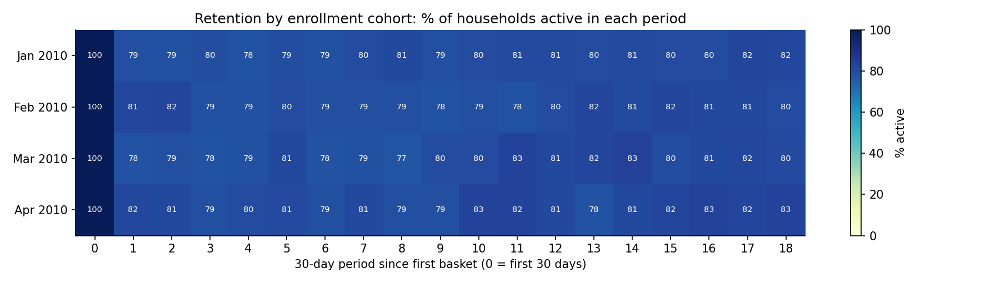
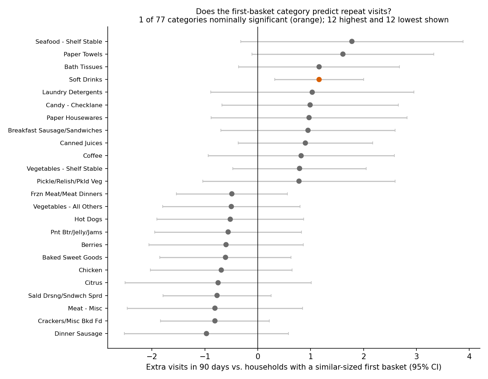
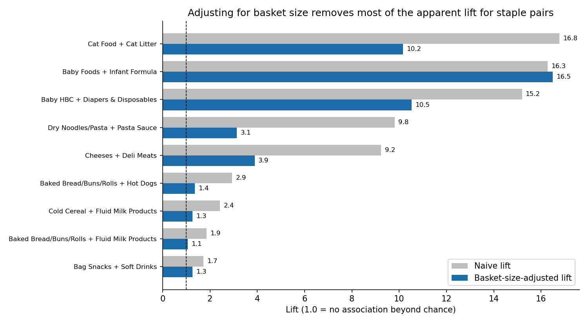
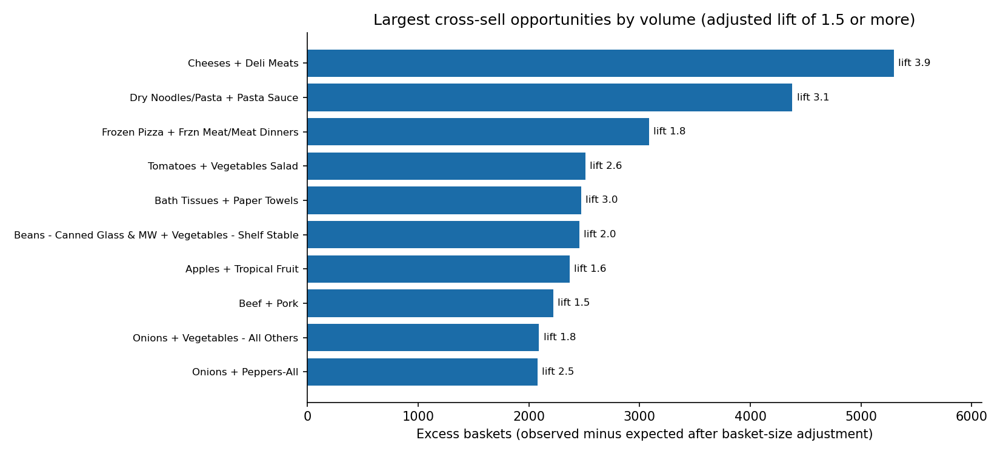
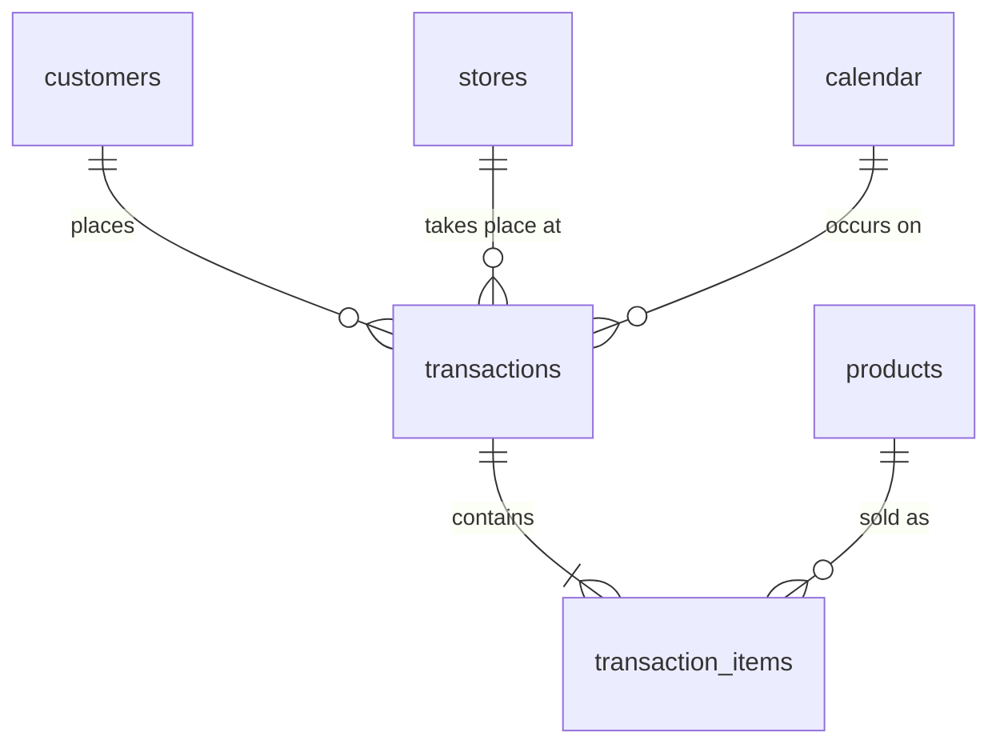

# Retail Sales & Basket Analysis (PostgreSQL)

SQL-driven cohort and market-basket analysis of 2.6M grocery transaction lines from 2,500 households across 556 stores. The project covers data profiling and cleaning, cohort analysis of repeat visits, and basket-size-adjusted cross-sell analysis.

**Tools:** PostgreSQL 18, SQL (CTEs, window functions, self-joins), Python (pandas, matplotlib) for charts only.

## Business questions

1. Does the category a household buys first predict how often it comes back?
2. Which category pairs are genuinely bought together once basket size is accounted for, and where is the cross-sell opportunity largest?

## Key findings

1. **Clean, reconciled data.** 2,595,732 raw lines became 2,544,612 clean lines (98.0% kept). 51,120 lines were removed: 18,879 with zero sales value and 32,241 non-merchandise lines (fuel, coupons, miscellaneous, blank category). Raw = removed + kept with 0 unaccounted, and item-level sales equals basket-level sales exactly.
2. **No first-basket category reliably predicts repeat visits.** Of 77 categories tested (at least 100 households each), 1 reached nominal significance (soft drinks: +1.2 visits in 90 days, +10%). About 4 false positives are expected by chance at the 5% level, and the result does not survive a Bonferroni correction (p of about 0.007 vs. about 0.0006 needed).
3. **Retention is flat at 78 to 83%** in every enrollment cohort over 18 months. This reflects the sample (frequent shoppers: 99.8% made 2 or more baskets), not retailer performance.
4. **Basket size inflates lift.** The naive lift was above 1 for 96.5% of 14,820 category pairs (median 2.13). After stratifying by basket breadth it was 44.9% (median 0.98), which is the expected baseline for unrelated pairs.
5. **Popular staples are over-credited by naive lift.** Bread + milk drops from 1.86 to 1.07, cold cereal + milk from 2.43 to 1.27, hot dogs + buns from 2.94 to 1.36. Baby foods + infant formula holds (16.3 to 16.5), and cat food + cat litter stays strong (16.8 to 10.2).
6. **Largest cross-sell volume** (baskets above what basket size predicts): cheeses + deli meats (+5,296 baskets, lift 3.9), dry pasta + pasta sauce (+4,380, lift 3.1), bath tissue + paper towels (+2,474, lift 2.9). A breakfast cluster spans two departments: bacon + eggs (+1,782, lift 1.6), breakfast sausage + eggs (+1,541, lift 1.5).
7. **Substitutes exist.** Deli meats and lunchmeat have an adjusted lift of 0.57: 1,528 fewer joint baskets than expected.
8. **Index tuning:** a basket lookup fell from 328 ms to 0.19 ms (about 1,760x) and a 3-table household query from 329 ms to 5.3 ms (about 62x).

Context: the median basket is 15.76 vs. a mean of 29.39 (right-skewed), the top 10% of households account for 33.5% of sales value, and 28.5% of baskets fall between 16:00 and 18:59.

## Recommendations

- **Bundle and co-locate by meal mission:** pasta + sauce, the breakfast cluster, and salad mix + dressing combine real lift with thousands of excess baskets.
- **Do not promote substitutes together:** deli meats and lunchmeat compete, so a joint offer would split demand.
- **Do not build acquisition or retention promotions around a "gateway" category:** the cohort test found none.
- **Prioritise by excess baskets, not lift alone:** the highest-lift pairs are often small niches.
- **Validate with an A/B test before rollout:** everything here is co-purchase association.

## Charts


*Share of each enrollment cohort active in every 30-day period. Period 0 is 100% by definition; read from period 1 onward.*


*Extra visits in 90 days vs. households with a similar-sized first basket, with 95% confidence intervals. Nearly all intervals cross zero.*


*Adjusting for basket size removes most of the apparent lift for staple pairs but not for baby and pet pairs.*


*Pairs with adjusted lift of at least 1.5, ranked by excess baskets (volume), with lift shown at each bar.*

## Data

[dunnhumby "The Complete Journey"](https://www.dunnhumby.com/source-files/): about 2 years of grocery purchases by 2,500 frequent-shopper households. The raw files are not included in this repo; download them from the link and place the CSVs in `data/`. Tables used: `transaction_data`, `product`, `hh_demographic`.



## Pipeline

| Script | Purpose |
|---|---|
| `sql/01_schema.sql` | Staging tables for the raw CSVs |
| `sql/03_profiling.sql` | Eight data-quality checks (nulls, negatives, duplicates, orphans, basket integrity, placeholders) |
| `sql/04_cleaning.sql` | Clean tables with primary and foreign keys, calendar, non-merchandise flag, cleaning log, reconciliation checks |
| `sql/05_eda.sql` | Monthly revenue with `LAG`, store `RANK`, category share, basket statistics, spend deciles with `NTILE`, hourly pattern |
| `sql/06_cohort_diagnostics.sql` | Enrollment ramp-up, churn and inter-visit gaps, which drove the cohort design |
| `sql/07_cohorts.sql` | First-basket-category cohorts, basket-size-adjusted 90-day visits, retention table |
| `sql/08_basket_analysis.sql` | Support, confidence and lift for category pairs |
| `sql/09_basket_adjusted.sql` | Stratified (basket-size-adjusted) lift |
| `sql/10_export_and_priorities.sql` | CSV exports and excess-baskets ranking |
| `sql/11_performance.sql` | Indexes and `EXPLAIN (ANALYZE, BUFFERS)` before/after |
| `python/make_charts.py` | Builds the four charts from the exported CSVs |

The numbering skips 02 because that step is the CSV load, shown under "How to reproduce".

**SQL techniques:** CTEs, window functions (`LAG`, `RANK`, `NTILE`, `ROW_NUMBER`, `SUM() OVER`, `FIRST_VALUE`), `FILTER` aggregates, `PERCENTILE_CONT`, `MODE() WITHIN GROUP`, `DISTINCT ON`, self-joins, `CREATE TABLE AS`, constraints, transactions, reconciliation checks, indexing, query-plan analysis.

## Design decisions

- **Cleaning rules come from profiling, with every rule logged.** Zero-revenue lines are removed. Fuel, coupon, miscellaneous and blank-category lines are excluded because they are not grocery baskets. Zero-quantity or very large lines that still have revenue are kept and flagged. Only exact placeholder categories are excluded, so real categories such as `CRACKERS/MISC BKD FD` stay in.
- **Cohorts use first-basket category, not first-purchase month.** 99% of households first appear between January and April 2010 (study enrollment), and only 2.8% stop shopping, so month cohorts and "ever returned" cannot discriminate.
- **Outcome is shopping days in the 90 days after the first basket,** compared with households that had a similar-sized first basket (5 tiers), because small top-up baskets come from more frequent shoppers.
- **Lift is stratified by basket breadth** (5 tiers by number of categories). Expected pair counts are computed within each tier, so large stock-up baskets do not inflate every pair.

## Limitations

- **Dates are synthetic.** The source provides day numbers 1 to 711. Day 1 is anchored to 2010-01-01 so monthly trends can be built. No seasonality or weekday claims are made.
- **The households are a tracked sample of frequent shoppers.** Retention here describes the sample, not retailer performance.
- **Association, not causation.** A household's first tracked basket is not its true first purchase, and the size adjustment is partial.
- **Store figures are the tracked households' spend,** not total store sales.
- **Category definitions are judgment calls.** Categories are `commodity_desc`. Catch-all labels (such as `REFRIGERATED`, `FROZEN`) and same-family categories filed in two departments were excluded from the recommendations.
- **Counts come from 2,500 households,** so scale them before sizing a business case.
- **The source states no currency,** so values are reported as plain numbers.
- **Timings are indicative:** one run on one basket and one household, warm cache, on a laptop.

## How to reproduce

Requires PostgreSQL (developed on 18.6) and Python 3 with `pandas` and `matplotlib`. Run everything from the project root.

```bash
createdb retail_analysis
psql retail_analysis -f sql/01_schema.sql

# load the CSVs (step 02)
psql retail_analysis -c "\copy retail.stg_transaction_data FROM 'data/transaction_data.csv' CSV HEADER"
psql retail_analysis -c "\copy retail.stg_product FROM 'data/product.csv' CSV HEADER"
psql retail_analysis -c "\copy retail.stg_hh_demographic FROM 'data/hh_demographic.csv' CSV HEADER"

for f in 03_profiling 04_cleaning 05_eda 06_cohort_diagnostics 07_cohorts \
         08_basket_analysis 09_basket_adjusted 10_export_and_priorities 11_performance; do
  psql -v ON_ERROR_STOP=1 retail_analysis -f sql/$f.sql
done

python3 python/make_charts.py
```

Saved query outputs are in `results/`.

---

Author: [Your name] · [LinkedIn] · [Email]
